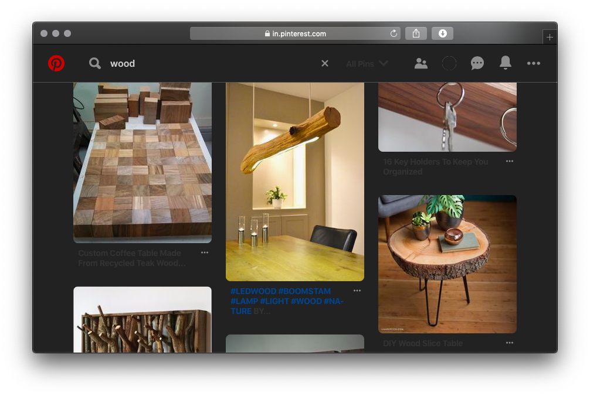

# Weblets
Weblets are tiny bits of `AppleScript` that I use to customize my often-visited websites to my liking. I'm sharing these here in case you might find them useful too.

### Requirements
. | .
------------ | -------------
Operating System | MacOS (tested on Mojave but it should work on other versions as well)
Browser | Safari (change "Safari" in the script to "Google Chrome" if you want the Weblets to work in Chrome instead of Safari.)
Other notes | Make sure the website you want the weblet to work on is running in the active tab before you run the weblet.

### How to run a Weblet
I use fish shell to set up an alias (keyword) that allows me to trigger even complex weblets by entering just the alias (keyword) in my terminal. For example, I enable Dark mode on Pinterest by just typing `pinterest.dark` in my terminal because my `config.fish` has this entry in it:
```applescript
alias pinterest.dark "osascript -e 'tell application \"Safari\" to do JavaScript \"setInterval(() => {document.body.style.background=\'#222\'; let qs = l => [...document.querySelectorAll(l)];qs(\'.HeaderContent div\').map(l => {l.style.background=\'#222\'; l.style.border=\'none\'});qs(\'.HeaderContent hr\').map(l => l.style.borderTop=\'1px solid #555\');
document.querySelector(\'.SearchBoxInput\').style.color=\'#CCC\';let qsd = qs(\'div\');qsd.filter(l => l.getBoundingClientRect().height>300).filter(x => x.style.backgroundImage).filter(x=>x).map(x=>x.style.background=\'#222\');qsd.filter(l => l.style.backgroundColor).map(x => x.style.backgroundColor=\'#222\');}, 1000)\" in front document'"
```

Since fish shell has autocomplete built in, I never have to type the whole alias (keyword); just the first three to four letters than `TAB` and `ENTER` to trigger the weblet.

---

# List of Weblets
* **Dark Mode for Pinterest**

  Why they don't offer this option on their site is beyond me.
  

* **Maximize Codepen editor**

  Gets rid of most of the clutter and allows you to focus on just your code.
